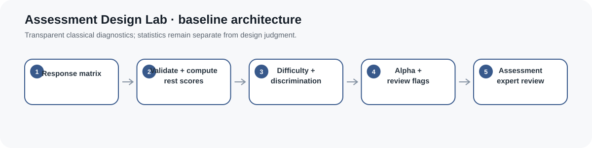
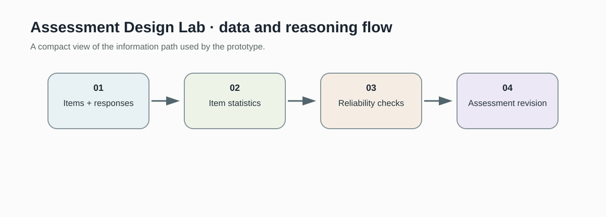
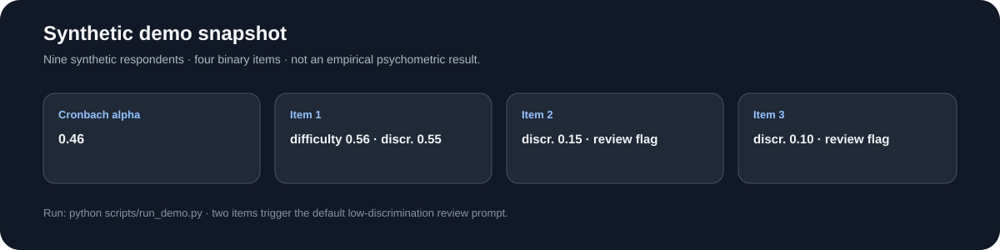
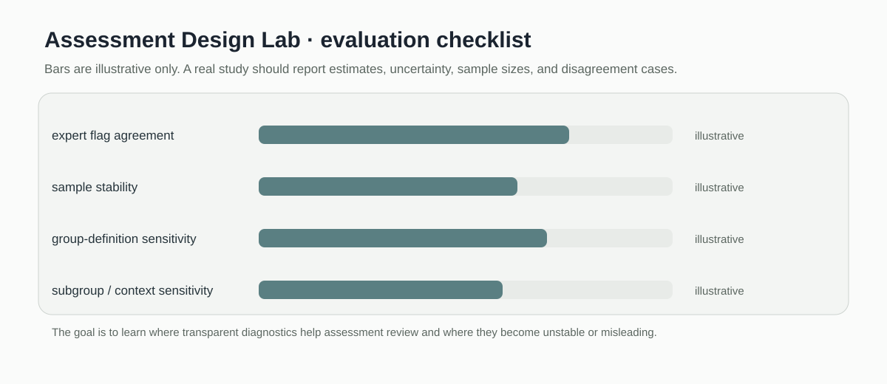

# Assessment Design Lab

> Transparent assessment analytics for item difficulty, discrimination, reliability, and evidence based item review.

[](https://github.com/devissaputra/assessment-design-lab/actions/workflows/ci.yml)



**Area:** Instructional Design & Curriculum Intelligence    
**Status:** working research prototype  
**Author:** Devis Wawan Saputra

## What this project is for

This repository turns assessment response data into practical item-level evidence. The baseline calculates item difficulty, discrimination, and internal-consistency statistics so an assessment designer can find items that deserve closer review.

**Who may find it useful:** Assessment designers, instructors, and learning researchers who want transparent diagnostics before reaching for more complex psychometric models.

## Research questions

1. Which items are too easy, too difficult, or weakly discriminating?
2. What reliability evidence is appropriate for a given assessment design?
3. How can item diagnostics feed back into instructional design?

## How it works

The code works directly from a response matrix. It computes item difficulty, compares upper and lower score groups for discrimination, and calculates Cronbach alpha after validating the matrix shape. These are basic diagnostics, but they are fully reproducible and easy to audit.



Responses move through item statistics and reliability checks before any revision decision. The prototype does not pretend that one coefficient proves validity; it keeps the statistics separate from the design judgment.



This snapshot shows the bundled synthetic example for Assessment Design Lab. It checks the software path; it is not an empirical performance result.

## Methods in the current baseline

- item difficulty
- upper and lower group discrimination
- Cronbach alpha
- response matrix checks
- assessment review signals

## Data

Synthetic response matrices and item metadata are included.

`data/README.md` documents the sample schema and the conditions that should be recorded before any real dataset is connected. Restricted or identifiable learner data should stay outside the repository.

## Run the demo

```bash
git clone https://github.com/devissaputra/assessment-design-lab.git
cd assessment-design-lab
python scripts/run_demo.py
python -m unittest discover -s tests -v
```

The demo prints three values from a small synthetic response matrix: difficulty, discrimination, and Cronbach alpha. No external package or dataset is required.

## What to evaluate next

The next study should use a real assessment with documented item content and enough responses for stable estimates. I would add distractor analysis and compare statistical flags with expert item review instead of treating a threshold as an automatic decision.

## Evaluation view



The Assessment Design Lab dashboard is an evaluation checklist rather than a result chart. The bars are illustrative only; the labels show the evidence a real study would need to collect.

## Limits and responsible use

These statistics do not establish content validity, fairness, or instructional alignment on their own. The bundled matrix is synthetic and only demonstrates the calculations. See `docs/ethics_and_risks.md` for the broader risk review.

## Repository map

```text
.
├── .github/workflows/ci.yml
├── assets/
│   ├── architecture.svg
│   ├── data_flow.svg
│   ├── demo_snapshot.svg
│   └── evaluation_dashboard.svg
├── data/
│   ├── README.md
│   └── sample.csv
├── docs/
│   ├── ethics_and_risks.md
│   ├── related_work.md
│   └── research_protocol.md
├── reports/model_card.md
├── scripts/run_demo.py
├── src/assessment_design_lab/core.py
├── tests/test_core.py
├── CITATION.cff
├── LICENSE
├── pyproject.toml
└── README.md
```

## Research path

A credible next version would:

1. test the diagnostics on a public assessment dataset
2. add distractor and missing response analysis
3. compare automated flags with judgments from assessment experts

## Related work

`docs/related_work.md` points to open projects that are relevant to this problem area. They are context for comparison and study design; this repository does not present their code as its own.

## Citation and license

`CITATION.cff` contains the software citation. The code and original SVG visuals use the MIT License. Any external dataset keeps its own license and usage conditions.
