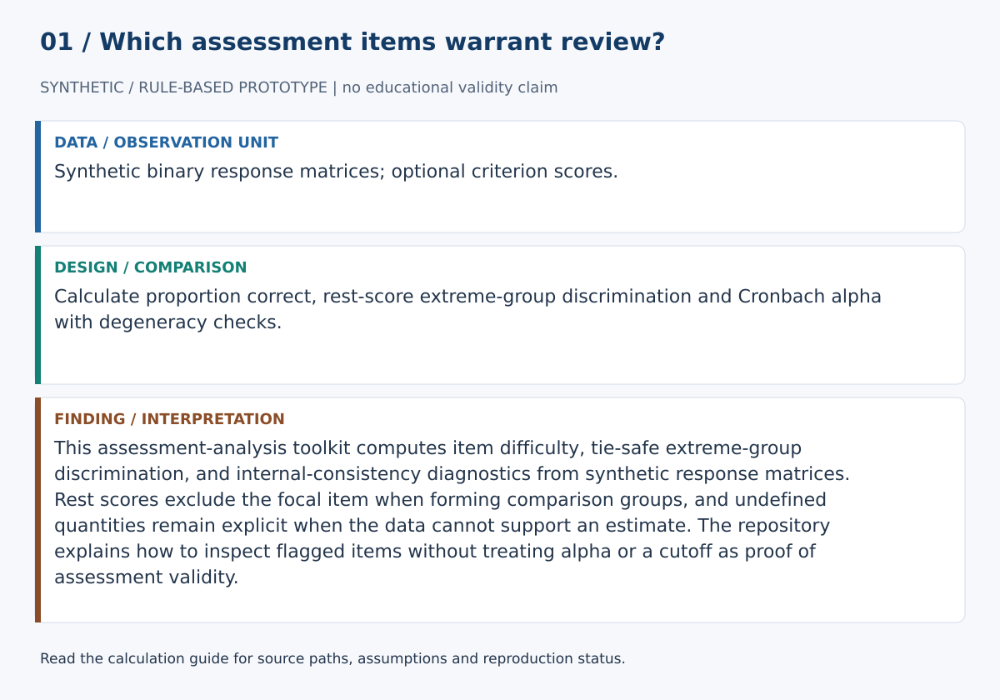
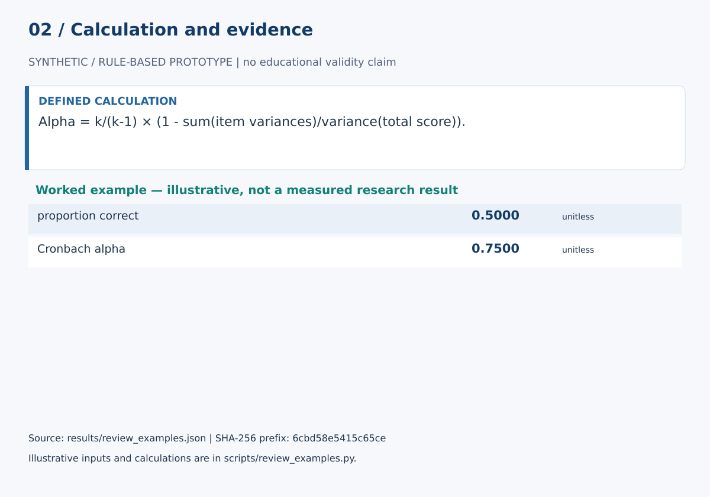

# Assessment Design Lab

This assessment-analysis toolkit computes item difficulty, tie-safe extreme-group discrimination, and internal-consistency diagnostics from synthetic response matrices. Rest scores exclude the focal item when forming comparison groups, and undefined quantities remain explicit when the data cannot support an estimate. The repository explains how to inspect flagged items without treating alpha or a cutoff as proof of assessment validity.

## Start here

- [Calculations, evidence and verification scope](CALCULATIONS.md)
- [Figure sources and exact numerical paths](docs/figure_spec.json)
- [Data status](data/README.md)





**Review scope:** 19 existing unittest checks passed. The bundled demonstration executed successfully in this review.

## Detailed project documentation

> Transparent classical assessment diagnostics for item difficulty, rest-score discrimination, internal consistency, and evidence-based item review.

[](https://github.com/devissaputra/assessment_design_lab/actions/workflows/ci.yml)


**Area:** AI in Education (AIEd) · Assessment Analytics & Instructional Design  
**Status:** working research prototype  
**Author:** Devis Saputra

## What this project is for

Assessment response data can reveal useful patterns, but a statistic should not become an automatic item-quality verdict. This repository provides a transparent classical-test-theory baseline for inspecting binary-scored assessment items and deciding what deserves closer expert review.

**Who may find it useful:** assessment designers, instructional designers, instructors, curriculum teams, and education researchers who want auditable diagnostics before moving to more complex psychometric models.

## Research questions

1. Which items show extreme proportions correct or weak/negative discrimination?
2. How stable are these diagnostics across samples and grouping choices?
3. What does internal-consistency evidence add to item-level review, and where can it mislead?
4. How well do statistical review flags agree with assessment-expert judgments?

## How it works

The integrated workflow accepts a binary response matrix with respondents in rows and items in columns.

For each item, the code:

1. calculates the proportion correct
2. computes each respondent's **rest score**, excluding the focal item
3. forms upper and lower groups from rest scores only
4. preserves ties at the group boundaries
5. calculates upper-minus-lower proportion correct when the groups can be separated
6. produces transparent review flags

At assessment level, the code calculates Cronbach alpha separately.


The baseline deliberately keeps item statistics, reliability evidence, and expert judgment separate.

## Why rest scores matter

Using a total score that includes the focal item can inflate the relationship between the item and the grouping criterion. This implementation excludes the focal item before forming the upper and lower groups.

The item response is also **never used as a tie-breaker**. If score ties make the extreme groups overlap, discrimination is reported as not estimable rather than forcing an artificial separation.

## Synthetic demo


The bundled matrix contains nine synthetic respondents and four binary items. It demonstrates the software path only; it is not an empirical psychometric result.

## Current baseline methods

- binary item difficulty as proportion correct
- rest-score upper/lower-group discrimination
- tie-preserving group formation
- explicit not-estimable discrimination cases
- Cronbach alpha
- finite/rectangular response validation
- transparent item review flags
- integrated assessment analysis

The baseline does **not** implement distractor analysis, item response theory, differential item functioning, or missing-response modeling yet.

## Review signals

The default item-level review flags identify:

- low proportion correct
- high proportion correct
- low discrimination
- negative discrimination
- discrimination not estimable

These are review prompts, not automatic deletion rules. Cutoffs can be changed by the caller and should be justified for a real study.

## Data

`data/sample.csv` contains only synthetic responses.

`data/README.md` documents the current binary-response assumptions, rest-score discrimination method, missing-data limitations, and the metadata that a real assessment study should record.

## Run the demo

```bash
git clone https://github.com/devissaputra/assessment_design_lab.git
cd assessment_design_lab
python scripts/run_demo.py
python -m unittest discover -s tests -v
```

No external Python package is required for the current baseline.

## Core API

`item_difficulty(responses)` returns the proportion correct for a binary item.

`rest_scores(matrix, item_index)` computes respondent scores excluding the focal item.

`item_discrimination(responses, criterion_scores, ...)` calculates a tie-safe upper-minus-lower proportion-correct difference. It returns `None` when the extreme groups cannot be separated defensibly.

`cronbach_alpha(matrix)` calculates coefficient alpha and returns `None` when total scores have zero variance.

`item_review_flags(difficulty, discrimination, ...)` generates configurable review prompts.

`analyze_assessment(matrix, ...)` runs the integrated binary-item analysis and returns assessment metadata, alpha, item diagnostics, and review flags.

## Evaluation view


The evaluation graphic shows evidence a real validation study should collect. The bars are illustrative only and do not report measured performance.

## Limits and responsible use

Difficulty and discrimination are sample dependent. Cronbach alpha is an internal-consistency coefficient, not proof that an assessment is valid, fair, unidimensional, or instructionally aligned.

Small samples, guessing, speededness, multidimensionality, local item dependence, missing responses, and subgroup differences can all change the interpretation of these diagnostics.

The system is therefore an **assessment-review aid**, not an automatic grading, accreditation, item-deletion, or instructor-evaluation system.

See `docs/ethics_and_risks.md` for the broader risk review.

## Repository map

```text
.
├── .github/workflows/ci.yml
├── assets/
│   ├── architecture.svg
│   ├── data_flow.svg
│   ├── demo_snapshot.svg
│   └── evaluation_dashboard.svg
├── data/
│   ├── README.md
│   └── sample.csv
├── docs/
│   ├── ethics_and_risks.md
│   ├── related_work.md
│   └── research_protocol.md
├── reports/model_card.md
├── scripts/run_demo.py
├── src/assessment_design_lab/core.py
├── tests/test_core.py
├── .gitignore
├── CITATION.cff
├── LICENSE
├── pyproject.toml
└── README.md
```

## Research path

A credible next version would:

1. test the diagnostics on a public or appropriately licensed assessment dataset
2. quantify uncertainty and sample sensitivity
3. compare default and alternative extreme-group definitions
4. add missing-response handling
5. add option-level distractor analysis when item-option data are available
6. compare statistical flags with independent assessment-expert review
7. benchmark against established psychometric software
8. explore IRT or DIF methods only when the dataset and research question justify them

## Related work

`docs/related_work.md` places the implementation in classical test theory and reliability-analysis context, including Cronbach's original coefficient-alpha paper and established psychometric software ecosystems.

## Citation and license

`CITATION.cff` contains the software citation. Code and original SVG visuals use the MIT License. External assessment datasets and secure test materials retain their own licenses, governance rules, and security requirements.
